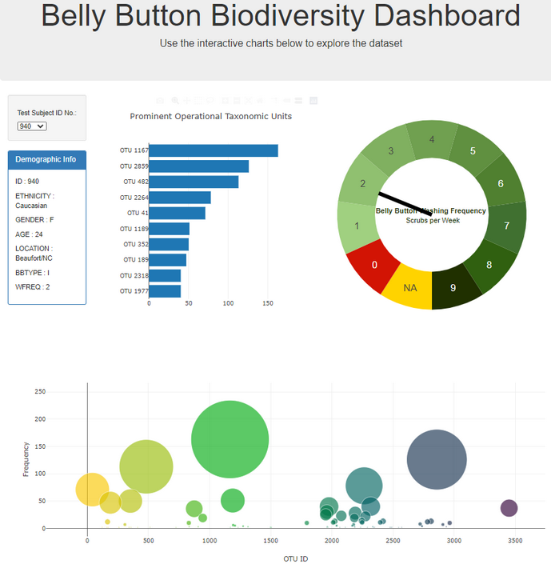

# plotly-challenge

This assignment creates an interactive dashboard to explore the Belly Button Biodiversity dataset, which catalogs the microbes that colonize human navels. The dataset reveals that a small handful of microbial species (also called operational taxonomic units, or OTUs, in the study) were present in more than 70% of people, while the rest were relatively rare.

### Technical information

 * The D3 library to reads in samples.json.
 * A horizontal bar chart displays the top OTUs found in that individual.
 * A bubble chart displays each sample.
 * A table presents a sample of the metadata, i.e., as an individual's demographic information as each key-value pair from the metadata JSON object.
 * A gauge (pie chart with line) dislay the wash frequency for the corresponding ID.
 * All of the plots update any time that a new sample is selected.
